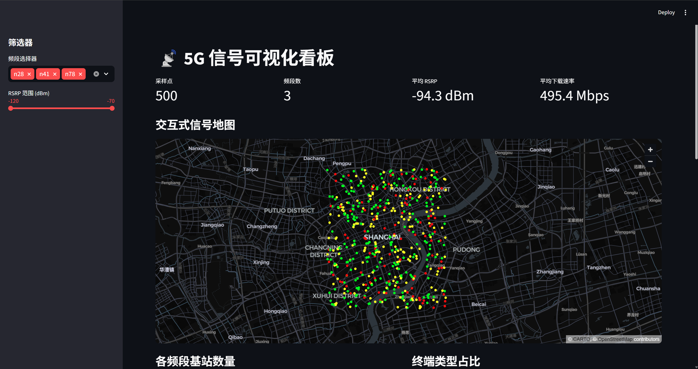
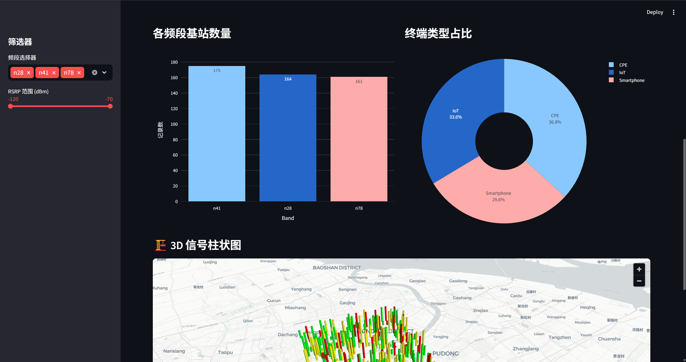
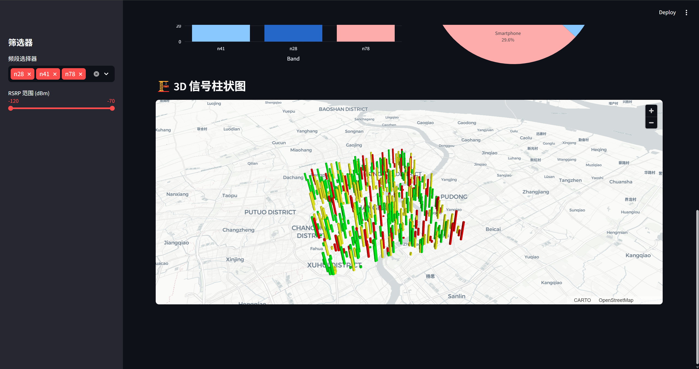
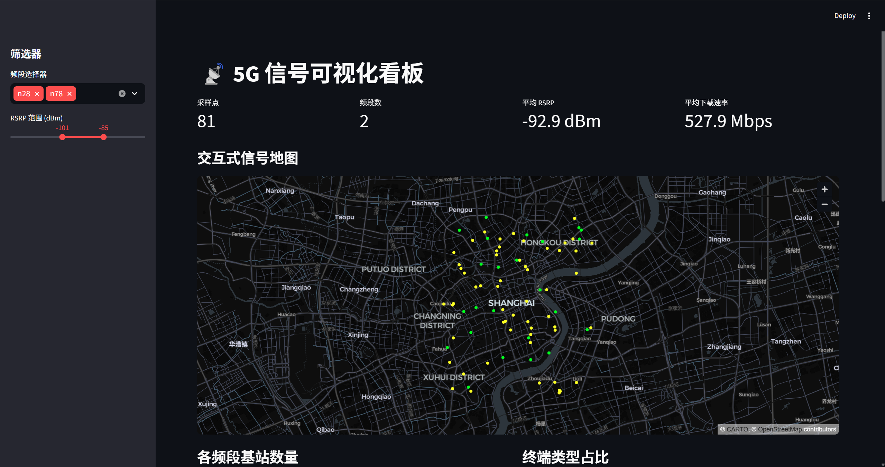
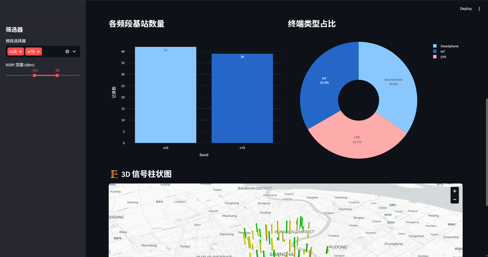
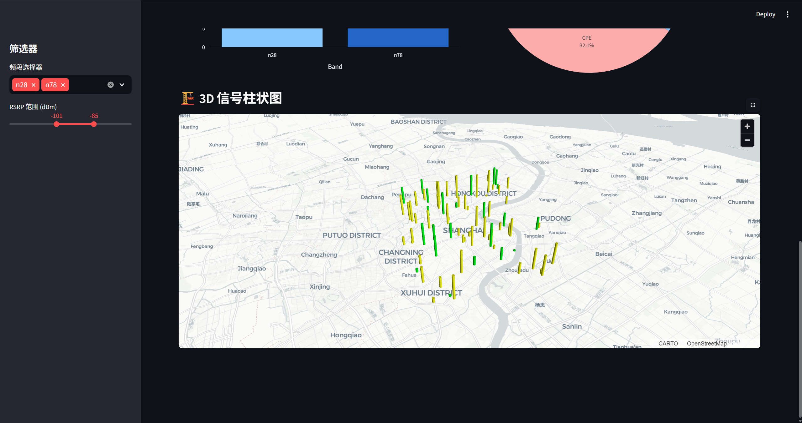

# 5G 信号可视化看板

这是一个基于 Streamlit 的本地 Web 数据看板，用于展示 5G 路测采样点、频段分布、终端类型占比以及下载速率驱动的 3D 信号柱状图。

## 功能简介

- 读取 `data/signal_samples.csv` 中的 5G 信号采样数据。
- 左侧边栏支持按频段和 RSRP 范围实时筛选。
- 使用 `st.map` 展示采样点地理位置，并按 RSRP 信号强度着色。
- 使用 Plotly 展示各频段记录数柱状图和终端类型占比饼图。
- 使用 pydeck `ColumnLayer` 展示 3D 信号柱状图，柱体高度与 `Download_Mbps` 成正比。

## 安装依赖

```bash
pip install -r requirements.txt
```

## 运行应用

```bash
streamlit run app.py
```

执行后浏览器会自动打开本地 Streamlit 页面。

## 数据文件位置

CSV 数据文件应放置在：

```text
data/signal_samples.csv
```

必须包含以下字段：

```text
Latitude, Longitude, CellID, Band, RSRP_dBm, SINR_dB, TerminalType, Download_Mbps
```

如果文件不存在，应用会在页面中显示友好错误提示并停止运行。

## 颜色编码与异常处理

RSRP 颜色规则：

- `RSRP_dBm > -90`：绿色，地图使用 `#00FF00`，3D 柱体使用 `[0, 255, 0]`
- `-110 <= RSRP_dBm <= -90`：黄色，地图使用 `#FFFF00`，3D 柱体使用 `[255, 255, 0]`
- `RSRP_dBm < -110`：红色，地图使用 `#FF0000`，3D 柱体使用 `[255, 0, 0]`
- 缺失、NaN 或非数值：灰色回退，地图使用 `#888888`，3D 柱体使用 `[128, 128, 128]`

应用在颜色映射函数中使用 `pd.isna()` 做保护性判断，避免空值或异常值导致 Streamlit 颜色列报错。

## 运行测试

```bash
python -m unittest test_app.py
```

## 截图







## 筛选栏






